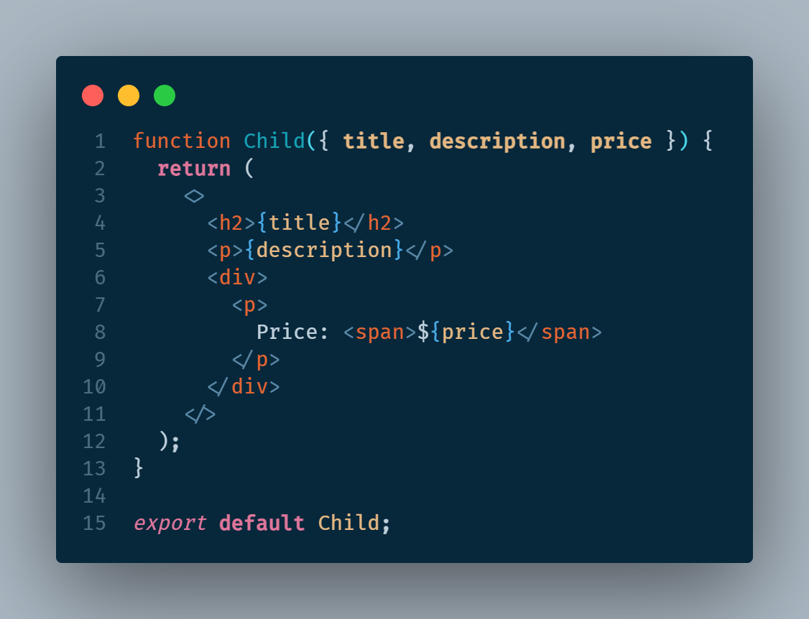
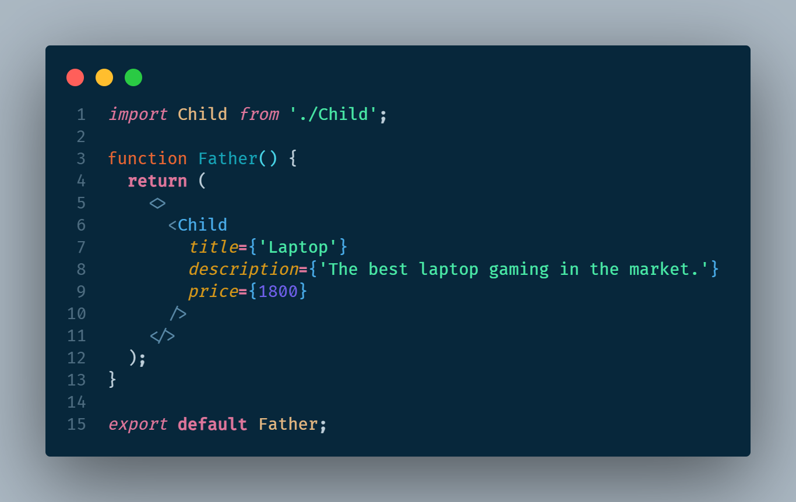
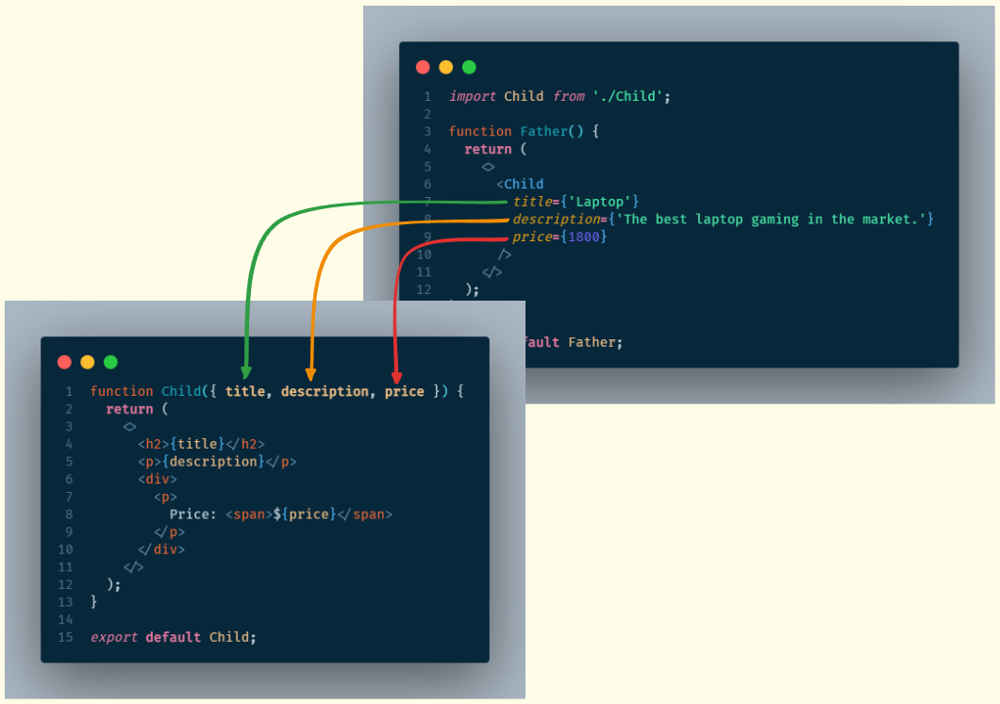

# REACT JS

React es una biblioteca de Javascript para construir interfaces de usuario dinámicas e interactivas. Fue creada por Facebook en el 2011.

Con React podemos describir una página web usando pequeños componentes reutilizables y React se encargará de crear y actualizar los elementos del DOM (Document Object Model). En resumen, los componentes nos ayudan a escribir código reutilizable, modular y mejor organizado.

Una aplicación de React es un árbol de componentes con el componente App como raiz que junta todo.

## Componentes de React

Para crear un componente en React se pueden usar clases o funciones, pero las funciones son más fáciles de escribir.
Tanto React como el estandar que lo controla, espera que los nombres de los componentes estén expresados en **PascalCasing** en el siguiente ejemplo se muestra la creación de un componente funcioanl.

```jsx
// JSX: JavaScript XML
function Message() {
    return (
        <h1>Hola nuevo programador!</h1>;
    )
}

// Para usarlo se exporta como un objeto predeterminado del modulo
export default Message;
```

JSX permite crear contenido dinámico al mezclar Javascript con HTML. El simbolo de llaves ({}) permite hacer que una variable o una funcion se pueda agregar a las etiquetas de HTML. Cualquier elemento que retorne un valor puede ser colocado dentro del simbolo de llaves ({})

```jsx
function Message() {
    const nombre = 'Lucy';
    return (
        <h1>Hola {nombre}!</h1>;
    )
}

```

## Como funciona React

Cuando la aplicación se inicia, React toma el árbol de componentes y crea una estructura llamada **Virtual DOM**. Este DOM virtual es una representación ligera en memoria del árbol de componentes y es distinto al DOM que tienen los navegadores. Cuando el estado del componente es actualizado, React actualiza el nodo correspondiente en el DOM virtual para reflejar el nuevo estado. Luego compara el estado del DOM virtual actual con el anterior para identificar los nodos que han sufrido algun cambio y deben actualizarce, luego actualizará esos nodos en el DOM real, el DOM del navegador

## Diferencias entre una biblioteca y un framework

- **Biblioteca:** Herramienta que proporciona una funcionalidad específica
- **Framework:** Proporciona un conjunto de herramientas y directrices para construir aplicaciones

## Renderizado condicional

Es una técnica usada para mostrar por pantalla componentes dependiendo de la evaluación de una condición. Existen várias formas de renderizar un elemento de forma condicional.

- Usando el operador ternario, se puede evaluar una condicion y renderizar uno y otro elemento dependiendo de la evaluación de esa condición.
- También se puede hacer esto es mediante la utilización del AND lógico (&&). La condición se evaluará y en caso de ser verdadera retornará la segunda parte de la expresión, mostrando por pantalla el mensaje deseado

```jsx
function Lista() {
  const ciudades = [];

  return (
    <>
      <h1>Lista de ciudades</h1>
      {ciudades.length === 0 ? <p>No hay ciudades.</p> : null}
      {ciudades.length === 0 && <p>No hay ciudades.</p>}
    </>
  );
}
```

## Paso de propiedades de un componente padre a un componente hijo

Para enviar propiedades de un componente superior o padre hacia un componente inferior o hijo en la estructura de árbol que crea React se hace lo siguiente.

### Componente hijo

El componente funcional hijo espera como parámetros de la función todos los valores que espera recibir desde quien está invocando esa funcion, es decir el componente padre. Existen dos formas de recibir esos parámetros:

- Creando un objeto único que agrupa todos los parámetros
- Desestructurando los parámetros para recibirlos uno a uno

```jsx
// recibiendo todos los parámetros en un objeto props
function Child(props) { ... }

// desestructurando los parámetros para recibirlos uno a uno
function Child({ title, description, price }) { ... }
```



### Componente padre

El componente padre deberá enviar las propiedades que espera el componente hijo como argumentos, a través de atributos que tiene el componente hijo. Los atributos se deben llamar igual en el componente padre y en el hijo para que se cree la relación correctamente

```jsx
// uso del componente hijo desde el componente padre
function Father() {
  return (
    <>
      <Child
        title={'Laptop'}
        description={'The best laptop gaming in the market.'}
        price={1800}
      />
    </>
  );
}
```





## Escucha de eventos enviados desde un componente hijo a un componente padre

## Hooks
