# REACT JS

React es una biblioteca de Javascript para construir interfaces de usuario dinámicas e interactivas. Fue creada por Facebook en el 2011.

Con React podemos describir una página web usando pequeños componentes reutilizables y React se encargará de crear y actualizar los elementos del DOM (Document Object Model). En resumen, los componentes nos ayudan a escribir código reutilizable, modular y mejor organizado.

Una aplicación de React es un árbol de componentes con el componente App como raiz que junta todo.

- [REACT JS](#react-js)
  - [Componentes de React](#componentes-de-react)
  - [Como funciona React](#como-funciona-react)
  - [Diferencias entre una biblioteca y un framework](#diferencias-entre-una-biblioteca-y-un-framework)
  - [Renderizado condicional](#renderizado-condicional)
  - [Paso de propiedades de un componente padre a un componente hijo](#paso-de-propiedades-de-un-componente-padre-a-un-componente-hijo)
    - [Componente hijo](#componente-hijo)
    - [Componente padre](#componente-padre)
  - [Notificar una acción desde un componente hijo hacia un componente padre.](#notificar-una-acción-desde-un-componente-hijo-hacia-un-componente-padre)
    - [Componente padre](#componente-padre-1)
    - [Componente hijo](#componente-hijo-1)
  - [Componentes como hijos de otro componente.](#componentes-como-hijos-de-otro-componente)
  - [Diferencia entre State \& Props](#diferencia-entre-state--props)
  - [Hooks](#hooks)
    - [useState](#usestate)
    - [useEffect](#useeffect)
    - [useRef](#useref)
    - [useMemo](#usememo)
    - [useCallback](#usecallback)
    - [useContext](#usecontext)
    - [useReducer](#usereducer)


## Componentes de React

Para crear un componente en React se pueden usar clases o funciones, pero las funciones son más fáciles de escribir.
Tanto React como el estandar que lo controla, espera que los nombres de los componentes estén expresados en **PascalCasing** en el siguiente ejemplo se muestra la creación de un componente funcioanl.

```jsx
// JSX: JavaScript XML
function Message() {
    return (
        <h1>Hola nuevo programador!</h1>;
    )
}

// Para usarlo se exporta como un objeto predeterminado del modulo
export default Message;
```

JSX permite crear contenido dinámico al mezclar Javascript con HTML. El simbolo de llaves ({}) permite hacer que una variable o una funcion se pueda agregar a las etiquetas de HTML. Cualquier elemento que retorne un valor puede ser colocado dentro del simbolo de llaves ({})

```jsx
function Message() {
    const nombre = 'Lucy';
    return (
        <h1>Hola {nombre}!</h1>;
    )
}

```

## Como funciona React

Cuando la aplicación se inicia, React toma el árbol de componentes y crea una estructura llamada **Virtual DOM**. Este DOM virtual es una representación ligera en memoria del árbol de componentes y es distinto al DOM que tienen los navegadores. Cuando el estado del componente es actualizado, React actualiza el nodo correspondiente en el DOM virtual para reflejar el nuevo estado. Luego compara el estado del DOM virtual actual con el anterior para identificar los nodos que han sufrido algun cambio y deben actualizarce, luego actualizará esos nodos en el DOM real, el DOM del navegador

## Diferencias entre una biblioteca y un framework

- **Biblioteca:** Herramienta que proporciona una funcionalidad específica
- **Framework:** Proporciona un conjunto de herramientas y directrices para construir aplicaciones

## Renderizado condicional

Es una técnica usada para mostrar por pantalla componentes dependiendo de la evaluación de una condición. Existen várias formas de renderizar un elemento de forma condicional.

- Usando el operador ternario, se puede evaluar una condicion y renderizar uno y otro elemento dependiendo de la evaluación de esa condición.
- También se puede hacer esto es mediante la utilización del AND lógico (&&). La condición se evaluará y en caso de ser verdadera retornará la segunda parte de la expresión, mostrando por pantalla el mensaje deseado

```jsx
function Lista() {
  const ciudades = [];

  return (
    <>
      <h1>Lista de ciudades</h1>
      {ciudades.length === 0 ? <p>No hay ciudades.</p> : null}
      {ciudades.length === 0 && <p>No hay ciudades.</p>}
    </>
  );
}
```

## Paso de propiedades de un componente padre a un componente hijo

Para enviar propiedades de un componente superior o padre hacia un componente inferior o hijo en la estructura de árbol que crea React se hace lo siguiente.

### Componente hijo

El componente funcional hijo espera como parámetros de la función todos los valores que espera recibir desde quien está invocando esa funcion, es decir el componente padre. Existen dos formas de recibir esos parámetros:

- Creando un objeto único que agrupa todos los parámetros
- Desestructurando los parámetros para recibirlos uno a uno

```jsx
// recibiendo todos los parámetros en un objeto props
function Child(props) { ... }

// desestructurando los parámetros para recibirlos uno a uno
function Child({ title, description, price }) { ... }
```


### Componente padre

El componente padre deberá enviar las propiedades que espera el componente hijo como argumentos, a través de atributos que tiene el componente hijo. Los atributos se deben llamar igual en el componente padre y en el hijo para que se cree la relación correctamente

```jsx
// uso del componente hijo desde el componente padre
function Father() {
  return (
    <>
      <Child
        title={'Laptop'}
        description={'The best laptop gaming in the market.'}
        price={1800}
      />
    </>
  );
}
```


## Notificar una acción desde un componente hijo hacia un componente padre.

Para poder escuchar desde un componente padre, eventos ejecutados dentro de un componente hijo, se deben enviar funciones que actuarán como callbacks desde el elemento padre hacia el hijo y esperar a que el hijo use esa función para finalmente notificar al componente padre que un evento ha ocurrido.

### Componente padre

El componente padre crea una funcion que por lo general tiene un nombre que inicia con `handle...`, el propósito de ésta función es el de manejar el evento generado desde el componente hijo, de allí que su nombre inicie con esta palabra. Es una convención que se sugiere seguir siempre. Esta función puede o no puede tener parámetros y será ejecutada desde el componente hijo, pero la lógica que se ejecutará estará implementada en el componente padre.

```jsx
function Father() {
  // función que pretende manejar el evento click de un botón que está en el componente hijo.
  // esta función espera recibir un mensaje como parámetro y posteriormente imprimir por consola el mensaje enviado desde el componente hijo.
  // notar que el nombre de la función inicia con la palabra 'handle' ya que manejará la notificación enviada desde el componente hijo.
  const handleClickButton = (message) => {
    console.log(`Message from button: ${message}`);
  };

  return (
    <>
      {/* el componente hijo espera recibir la función en un argumento llamado 'onClickButton'.  La función es enviada al componente hijo pero no se ejecuta inmediatamente, por eso, no se deben colocar paréntesis () al final del nombre de la función */}
      <Child onClickButton={handleClickButton} />
    </>
  );
}

export default Father;
```

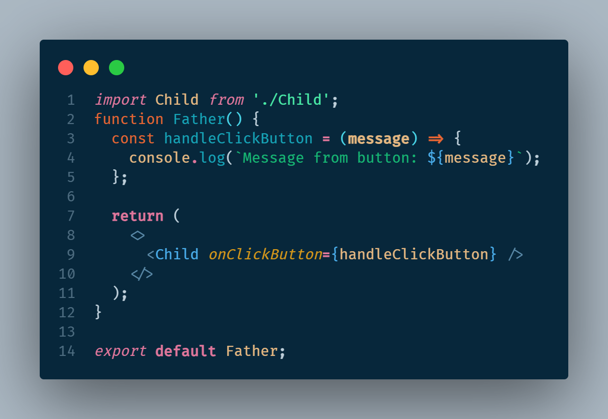

### Componente hijo

El componente hijo espera un valor cualquiera en sus parámetros y por eso se sugiere que si lo que se espera es una función para notificarle de la ocurencia de un eventos al componente padre, este parámetro inicie con `on...`. Luego, esta función es usada en alguno de los elementos del componente hijo que pueda disparar una acción, como por ejemplo los eventos `onClick`, `onFocus`, `onKeyDown`, etc.

```jsx
// El componente hijo espera recibir un valor por parámetro, se sabe que es una función porque inicia con 'on'.
function Child({ onClickButton }) {
  return (
    <>
      <button
        onClick={() => {
          // La función enviada desde el padre, será ejecutada dentro del evento 'onClick' del botón. Por eso, en este momento si se colocan los paréntesis () que indican la ejecución de la función y se envían todos los argumentos requeridos para que le componente padre los reciba y actúe según la lógica implementada.
          onClickButton('Hi, you click me');
        }}
      >
        Click Me!
      </button>
    </>
  );
}
```

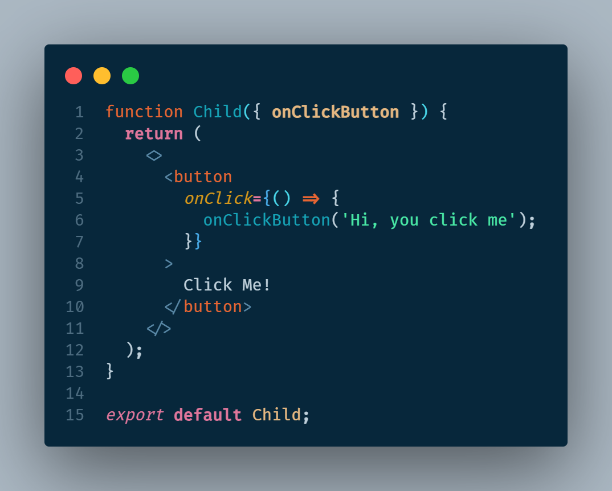

A continuación se explican en una secuencia los pasos efectuados durante la comunicación de los dos componentes.

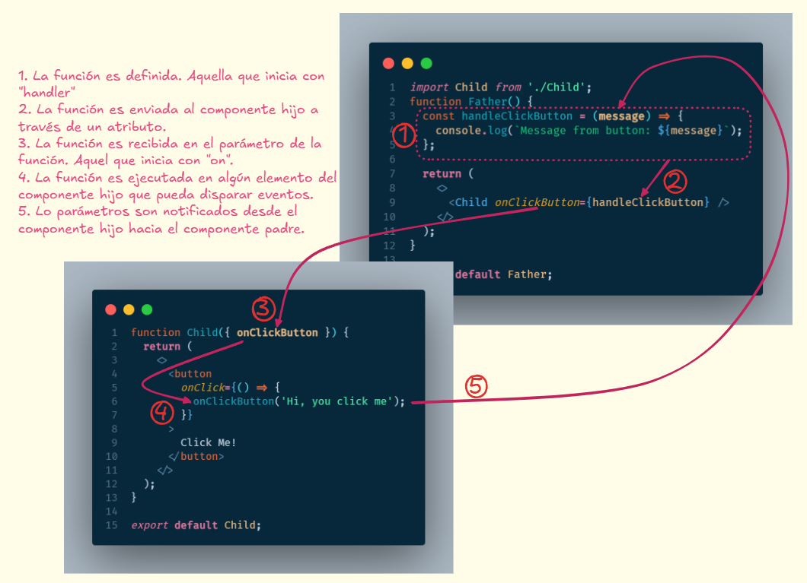

## Componentes como hijos de otro componente.

En react podemos crear componentes que tengan otros componentes internamente, permitiendo reutilización de código y también logrando adaptación y flexibilidad.
El objetivo de pasar otros componentes o incluso código HTML dentro de otro componente permite crear componentes reutilizables y modificables con una amplia variedad de posibilidades. Esto se puede lograr pasando todos los tags en una sola propiedad que por convención se llamará children y haciendo que se renderice todo en un componente hijo. El componente hijo actuará como un contenedor y permitirá mantener el mismo diseño, El componente padre es el que decidirá qué elementos le enviará al componente hijo para ser renderizados. El componente padre podrá usar tantas veces como quiera el componente hijo cambiando su contenido.

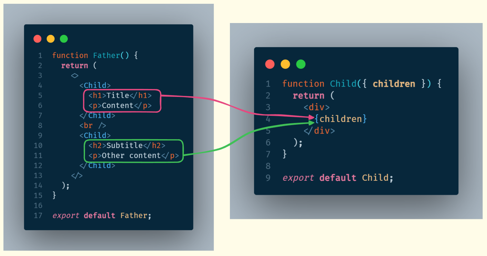

## Diferencia entre State & Props

**Props:**

- Son las entradas que se pasan a un componente.
- Son parecidas a los parámetros de una función.
- Se deben tratar como inmutables (que no se pueden cambiar).

**State:**

- Información manejada por un componente que puede cambiar con el tiempo.
- Son parecidas a las variables locales dentro de una función.
- Se deben tratar como mutables (pueden cambiar con el tiempo).

Algo que tienen en común las propiedades y el estado es que cada vez que cambian, React va a volver a renderizar el componente.

## Hooks

Los hooks permiten usar diferentes funcionalidades de React en sus componentes. La documentación official de los hooks se pueden encontrar en este [link](https://react.dev/reference/react/hooks) y está clasificada de la siguiente manera.

- **State Hooks:** Permiten a los componentes _recordar información._ Para agregar estados a los compnentes use los hook `🟢useState` o `🟢useReducer`.
- **Context Hooks:** Los contextos permiten que los componentes _reciban información de padres distantes sin la necesidad de pasarla como props._ Para este propósito puede usar el hook `🟢useContext`.
- **Ref Hooks:** Las referencias permiten que los componentes _mantengan alguna información que no es usada para renderizar la interfaz,_ como por ejemplo un nodo del DOM. Para agregar referencias puede usar los hooks de `🟢useRef` o `🟠useImperativeHandle`.
- **Effect Hooks:** Estos hooks permiten que los componentes se _conecten y se sincronicen con sistemas externos._ Esto incluye tratar con llamados a través de la red, DOM del navegador, animaciones y otro código que no sea parte de React. Para manejar efectos puede usar los hooks de `🟢useEffect`, `🟠useLayoutEffect` o `🟠useInsertionEffect`.
- **Performance Hooks:** Una forma de mejorar el rendimiento de las aplicaciones de React es evitando que los componentes se rendericen de forma innecesaria. Esto se logra diciendole a React que reuse algún calculo memorizado o que no renderice los componentes si la información no ha sido modificada. Para mejorar el rendimiento puede usar los hooks de `🟢useMemo`, `🟢useCallback`, `🟠useTransition` o `🟠useDeferredValue`.
- **Other Hooks:** Los siguientes hooks no son usados comunmente en aplicaciones. `🟠useDebugValue`, `🟠useId`, `🟠useSyncExternalStore` o `🟠useActionState`.

_Nota: los hooks marcados con 🟢 son altamente utilizados, mientras que los hooks que tienen un 🟠 son poco o rara vez usados o tienen alguna salvedad en su uso._

### useState

`useState` es un hook de React que crea una variable de estado, la cual nos ayuda a rastrear el estado en los componentes y actualiza la interface de usuario cuando este cambia.

Este hook permite que la interfaz se vuelva a renderizar en cada cambio del valor de la variable que usa este hook, de lo contrario, si tenemos una variable común creada con javascript (`const color = 'red'`), React no podrá detectar los cambios efectuados en esta variable y no actualizará la interfaz de usuario.

```jsx
// importar el hook desde la biblioteca de React
import { useState } from 'react';

function UseStateHook() {
  // el hook 'useState' retorna un arreglo que se puede desestructurar en dos elementos:
  //  - el primero es la variable de estado
  //  - el segundo es una función que ayuda a actualizar la variable de estado

  const [color, setColor] = useState('Red');
  // se crea una funcion que maneja el cambio de estado llamando a la función actualizadora dada por el hook useState
  const handleColor = () => setColor('Blue');
  return (
    <>
      <h1>My favorite color is {color}!</h1>
      <button onClick={handleColor}>Blue</button>
    </>
  );
}
```

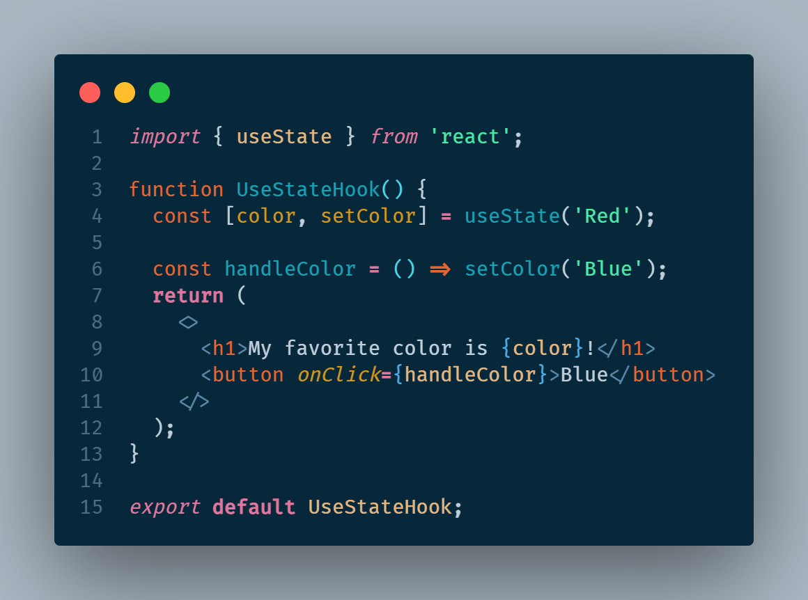

### useEffect

`useEffect` permite controlar posibles efectos secundarios de eventos usados en los componentes. Algunos eventos que pueden provocar efectos secundarios son:

- Obtener información de un API
- Actualizar el DOM directamente
- Uso de timers como SetTimeout y SetInterval

El hook `useEffect` es una función que recibe 2 parámetros

- Un callback que se encargará de manejar todos los efectos secundarios que puedan ocurrir en el componente.
- Una lista de dependencias que pueden desencadenar efectos secundarios. Esta lista es opcional.

  a. Si no se coloca, el componente se va a renderizar cada vez que se detecte un cambio en el estado o en las propiedades del componente. Este caso puede hacer que el componente se actualice de forma infinita.

  b. Si se coloca una arreglo vacío ([]), el compponente solo se va a renderizar una vez, cuando éste es cargado.

  c. Si se coloca algúna variable o lista de variables, el componente se va a renderizar cada vez que detecte un cambio en cualquiera de los elementos de esa lista.

```jsx
// importar los hooks que se quieren usar
import { useEffect, useState } from 'react';

function useEfectHook() {
  // este estado se utilizará para actualizar la página con un contador
  const [count, setCount] = useState(0);

  // el hook de useEffect va a manejar los efectos secundarios de usar un setTimeout, el cual va a incrementar el contador cada segundo
  useEffect(
    // callback: manejará el efecto secundario de usar la función setTimeout
    () => {
      setTimeout(() => {
        setCount((prev) => prev + 1);
      }, 1000);
    },
    // lista de dependencias: todas las dependencias que se quieren rastrear para ejecutar el hook, esta lista puede ser vacía []
    [count]
  );

  return (
    <>
      <h1>I`ve rendered {count} times</h1>
    </>
  );
}

export default useEfectHook;
```

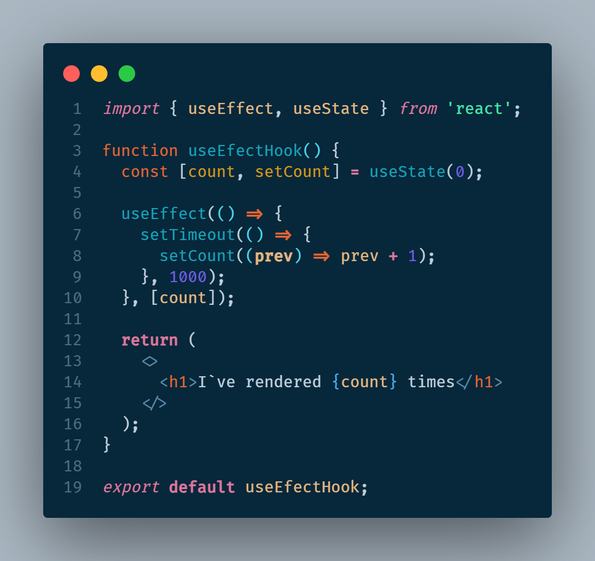

### useRef

`useRef` nos permite crear variables mutables las cuales no van a volver a renderizar el componente, se puede usar como una mejora en el rendimiento de la aplicación evitando que el componente vuelva a renderizarse cuando una variable cambia. Este hook también es usado para acceder a los elementos del DOM y con ello dar la posibilidad de manipular determinados elementos.

A continuación se muestran sus dos usos.

En la siguiente imágen se ve que en la línea 5 se crea una variable con el uso del hook `useRef` y su valor es inicializado en 0. luego, en la linea 7 se hace uso del hook `useEffect` para que cada vez que el componente es renderizado incremente el valor de la variable referenciada con el hook. El valor de esta variable se encuentra en la propiedad `current`. Finalmente en la línea 16 se muestra en la pantalla el valor que tiene la variable referenciada. De esta forma se evita que el componente se vuelva a renderizar cada vez que el valor de `count` es modificado.
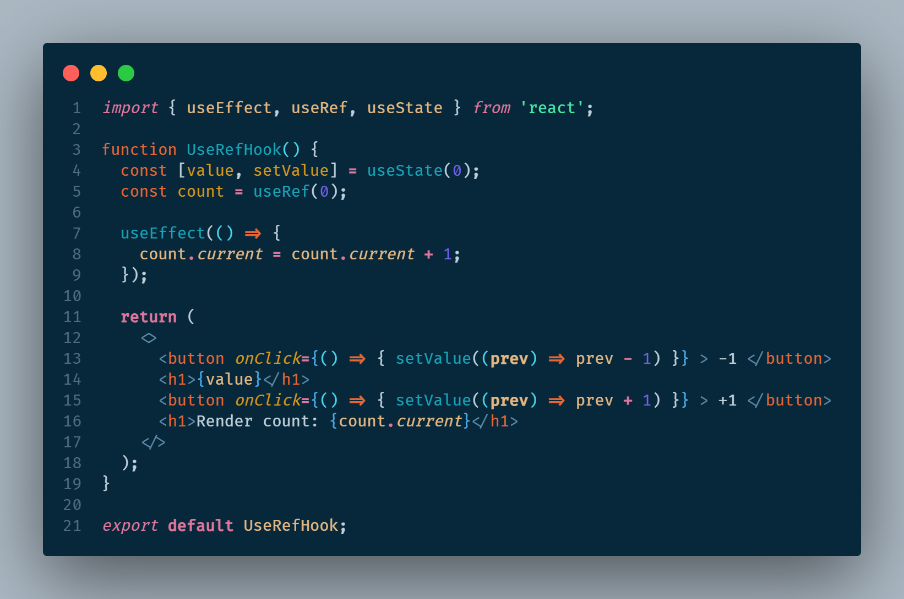

En el siguiente ejemplo de uso del hook `useRef`, se ve que en la linea 4 se crea una constante para guardar el elemento `input` que se encuentra en el DOM, finalmente en la linea 13, como uno de sus atributos se coloca la palabra `ref` y se asigna el elemento actual a la variable creada previamente. Se pueden usar eventos para manipular y cambiar el estado del elemento capturado, tal como lo hace la función implementada en la linea 6, la cual es llamada por el evento `onClick` del botón.
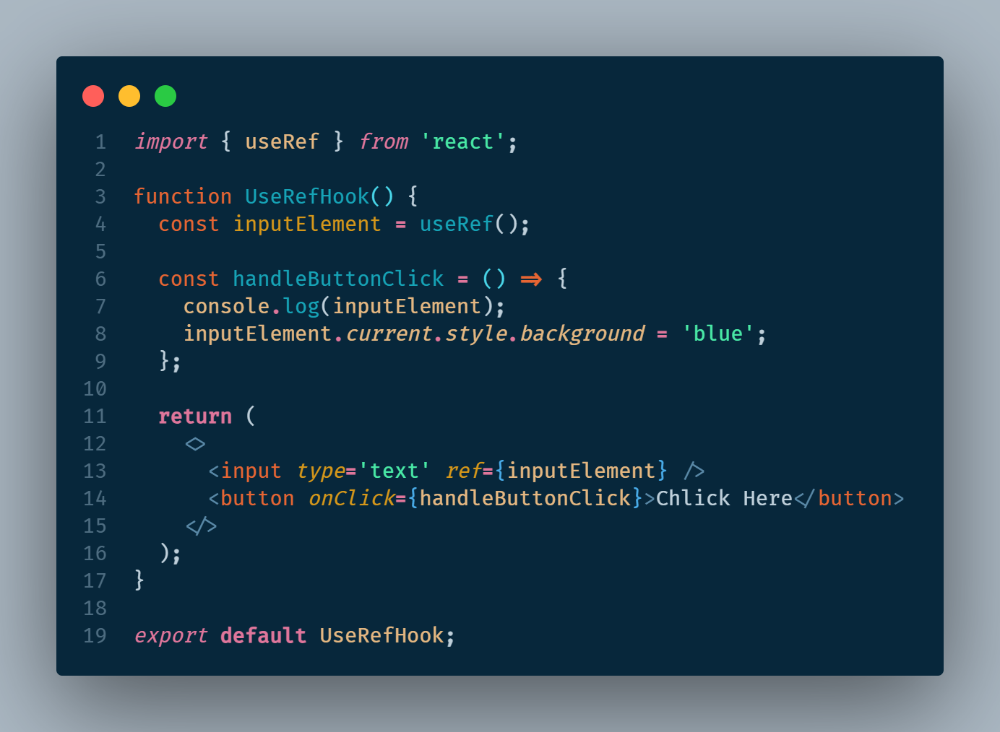

### useMemo

El hook `useMemo` retorna un valor memorizado. Es parecido a almacenar en cache un valor que no necesita ser recalculado. El hook `useMemo` solo se ejecuta cuando una de sus dependencias es actualizado y se puede mejorar el rendimiento de la aplicación evitando rehacer ciertos cálculos o volver a ejecutar otras tareas.

Este hook se caracteriza por retornar un valor memorizado.

El hook `useMemo` recibe 2 parámetros

- El primero parámetro es un callback que permite calcular el valor que se quiere guardar.
- El segundo parámetro es una lista de dependencias que permitirán recalcular el valor siempre que alguno de los valores de la lista de dependencias sea modificado.

El en el siguiente ejemplo se demuestra el uso del hook, en el cual, se tienen dos variables de estado, `number` y `counter`. La variable `number` es capturada con la ayuda de un elemento `input` y su valor nos ayudará a calcular la variable `result` declarada en la línea 12. Para calcular el valor de `result` se usa el hook `useMemo` que nos permite recordar el valor cálculado. Éste cálculo se volverá a efectuar siempre y cuando alguno de los elementos del arreglo de dependencias sea modificado. Para este ejemplo el callback del hook `useMemo` llama a la función que permite obtener el cuadrado del número ingresado en el `input` y el cual será recalculado cada vez que el valor de la variable `number` sea modificado. El estado de la variable `counter` puede cambiar tantas veces se quiera, y no afectará el cálculo de la variable `result`.
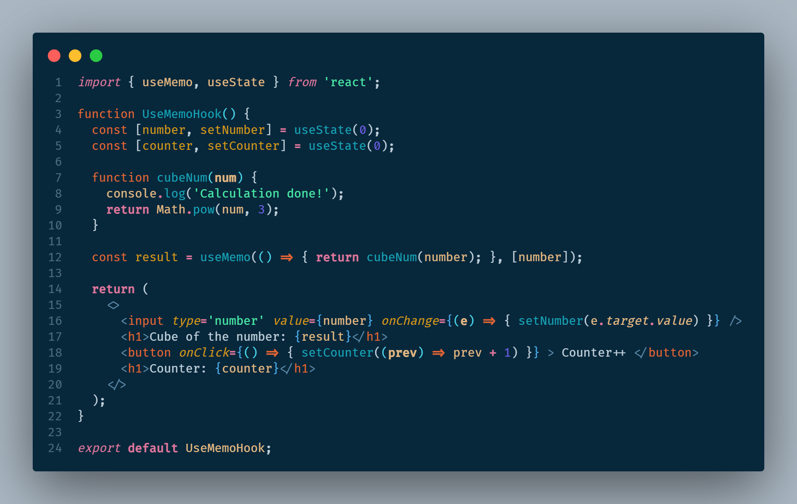

### useCallback

Este hook permite almacenar en cache la definición de una función entre renderizados. Quiere decir que no se van a crear múltiples instancias de la misma función cuando varios renderizados se realizan en secuencia. En lugar de crear una nueva instancia de la función, este hook devuelve la funcion memorizada entre los renderizados del componente.

Este hook se caracteriza por retornar una función memorizada.

El hook `useCallback` recibe 2 parámetros

- El primero parámetro es un callback el cual será la función a memorizar.
- El segundo parámetro es una lista de dependencias que permitirán actualizar el comportamiento de la función memorizada siempre que alguno de los valores de la lista sea modificado.

Cuando se tienen componentes anidados, uno dentro de otro y se quiere evitar que los componentes hijos en la jerarquía de árbol se vuelvan a renderizar debido a que sus propiedades no han cambiado, se puede utilizar la función de React llamada `memo`, la cual se usa encerrando el componente hijo dentro de esta función `export default React.memo(ChildComponent);`

El problema se presenta cuando se pasan funciones como parámetros de los componentes hijos, debido a que se va a crear una nueva función cada vez que se haga el renderizado del componente. Para evitar nuevos renderizados, se usa el hook de `useCallback` sobre la función que se quiere pasar al componente hijo tal como se muestra en el siguiente ejemplo.

Dentro del componente padre, se importa un componente hijo, el cual no cambia nunca su estado, para evitar que el componente hijo se renderice cada vez que el componente padre lo hace, se marca el componente hijo con la función `memo` tal como se ve en la línea 12 del componente hijo. Si es necesario pasar funciones desde el componente padre al componente hijo, la función es creada usando el hook `useCallback` tal como se ve en la linea 7 del componente padre. Luego la función es pasada en un atributo hacia el componente hijo y solo se actualizará cuando alguno de los elementos del arreglo de dependencias es modificado
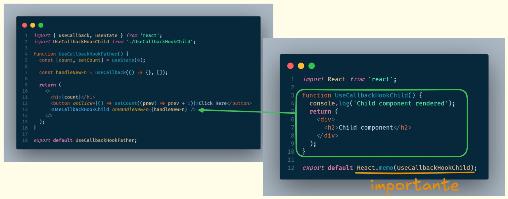

### useContext

El hook `useContext` permite acceder a la información desde cualquier componente sin la necesidad de pasarla como propiedades a ningún componente anidado en cualquier nivel que se encuentre. `useContext` es usado para manejar información global en una aplicación React.

Para usar el hook `useContext` se pueden seguir los siguientes pasos:

1. Crear el contexto que se quiere pasar a través de toda la aplicación.
2. Proveer a la aplicación de React con el contexto creado.
3. Consumir el contexto en los componentes que lo requieran.

La creación del contexto se hace mediante la utilización de la función `createContext` proporcionada por React, esta funcion retorna el contexto como tal y lo único que hace falta es agregar los valores que se quieren guardar en el contexto, tal como se muestra en la línea 15; en el campo `value` se puede agregar un objeto que puede tener varias propiedades, incluidas funciones.

Este contexto actúa como contenedor de todos los elementos hijos que se le pasen, de este modo, al estar encerrando a otros componentes, el contexto puede ser accesible por todos los componentes internos. Tanto el contexto como un proveedor del contexto son exportados de este archivo.
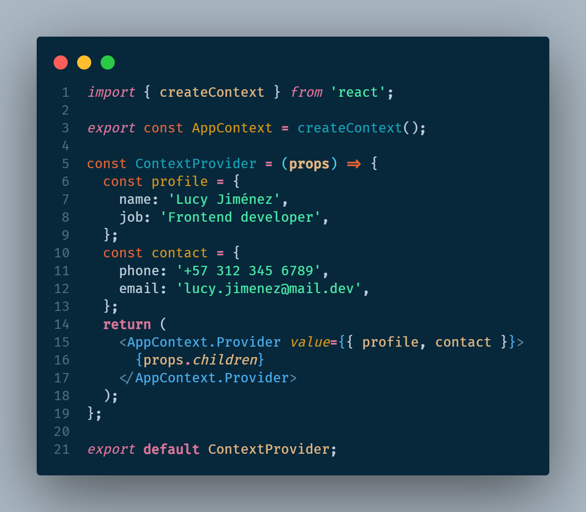

La configuración y aplicación del contexto se hace en el archivo principal de renderizado de la aplicación, el archivo `main.jsx`. Se importa el proveedor del contexto creado anteriormente y se envuelve la aplicación con este componente, permitiendo que toda la aplicación pueda tener acceso a los valores guardados en el contexto.
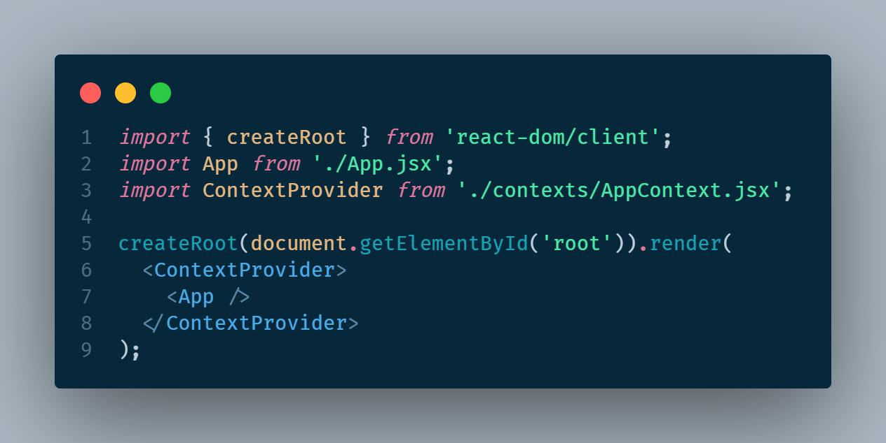

Finalmente desde cualquier componente que se encuentre dentro de la aplicación se puede acceder a los valores guardados dentro del contexto haciendo uso del hook `useContext` e indicando cúal es el contexto al que se quiere acceder, en este caso al contexto creado en el primer paso y de nombre `AppContext`. Se puede verificar el uso del hook en la linea 5. Desestructurando el contenido, se puede recuperar solamente los valores que necesitemos en cada uno de los componentes y luego pueden ser usados como valores en el componente que consume el contexto.
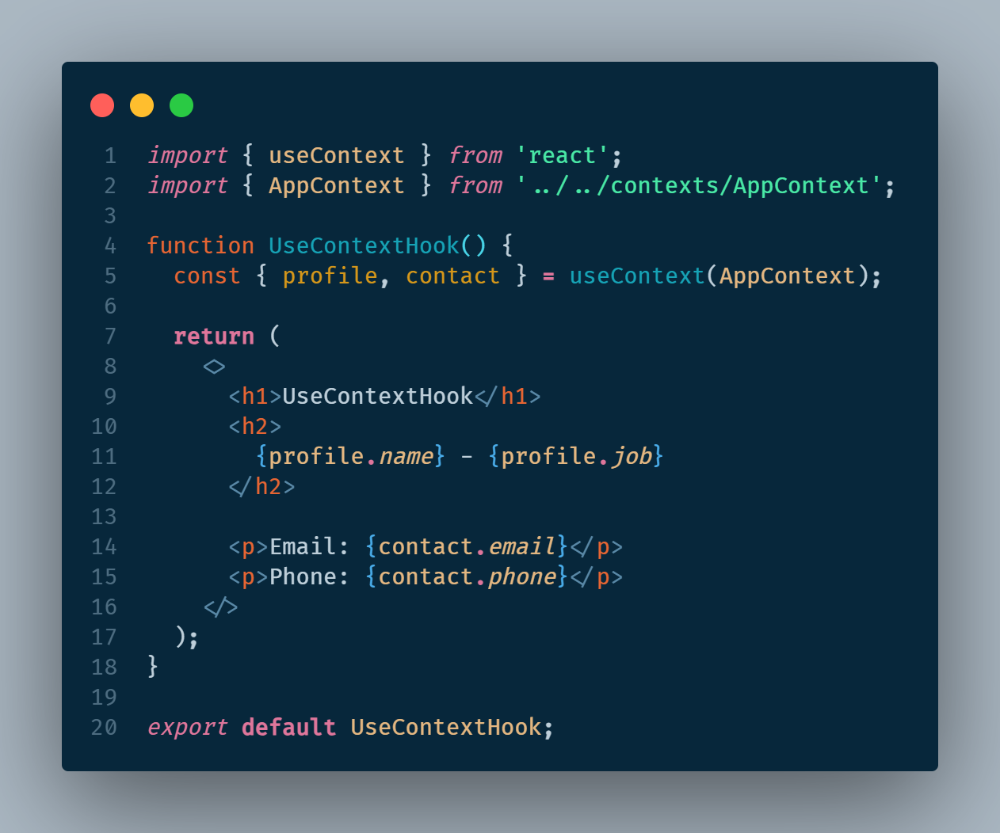

En la siguiente imágen se puede ver la relación entre los 3 componentes afectados y cuál es el flujo de importaciones y exportaciones de los elementos usados con el hook `useContext`
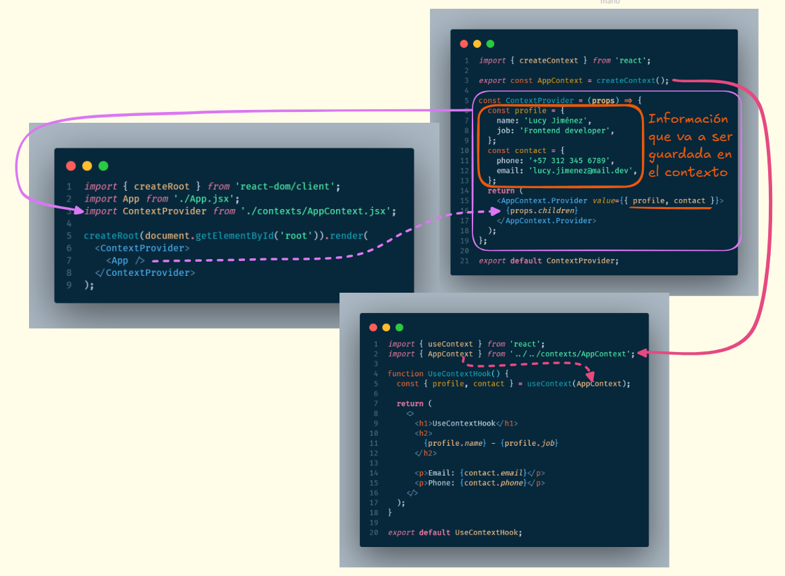

### useReducer

`useReducer` es similar a `useState` pero en lugar de proveer un estado y una función para modificar ese estado, este hook provee un estado y una función de despacho (dispatch function).

El hook `useReducer` acepta 2 parámetros.

- Una función reductora. Esta función especifíca como el estado es actualizado.
- Un valor inicial. Este valor inicial será un objeto que puede ser modificado por la función reductora.
- Este hook retorna el estado actual y un método para actualizar el estado.

En el ejemplo mostrado a continuación se puede ver que en la línea 5 se crea el estado inicial y es asignado a una variable, este estado inicial es un objeto con toda la información necesaria.

En la línea 6 se crea la función reductora que recibe el estado actual `state` y una `action` el cual determinará la acción a realizar que es manejada por un `switch` evaluando los casos del parámetro `action.type` o el tipo de la acción. Cada caso retorna un nuevo objeto con las propiedades del state original y solo modificando las propiedades necesarias según cada tipo que ha sido evaluado en los distintos casos del switch. Si el tipo no está determinado se retorna el estado sin modificaciones.

En la línea 14 se ve el uso del hook `useReducer` el cual recibe por parámetro la función reductora `reducer` y el estado inicial `initialState`. Esta función retorna un arreglo que puede ser desestructurado en 2 elementos, el primero es el estado actual `state` y el segundo elemento es una función que ayuda a modificar el estado, `dispatch`.

Finalmente tanto como el estado actual como la función de despacho que ayuda a modificar el estado puede ser usado en el componente. `state` al ser un objeto, se debe acceder a sus propiedades con la notación punto `state.count`. La función `dispatch` envía por parámetro un objeto con el tipo que se quiere evaluar (`dispatch({ type: 'tipo-evaluado-switch-case'})`) y posteriormente puede ser ejecutado por la función reductora.

La función `dispatch` también puede ser usada para enviar información a la función reductora, mediante la propiedad `payload` (`dispatch({ payload: 'valor-u-objeto' })`), tal como se muestra en la linea 26; este valor llegará a la función reductora en el parámetro action y podrá ser recuperado y procesado tal como se hace en la línea 9 en la cual se asigna el valor del `payload` al estado en su propiedad `count
`

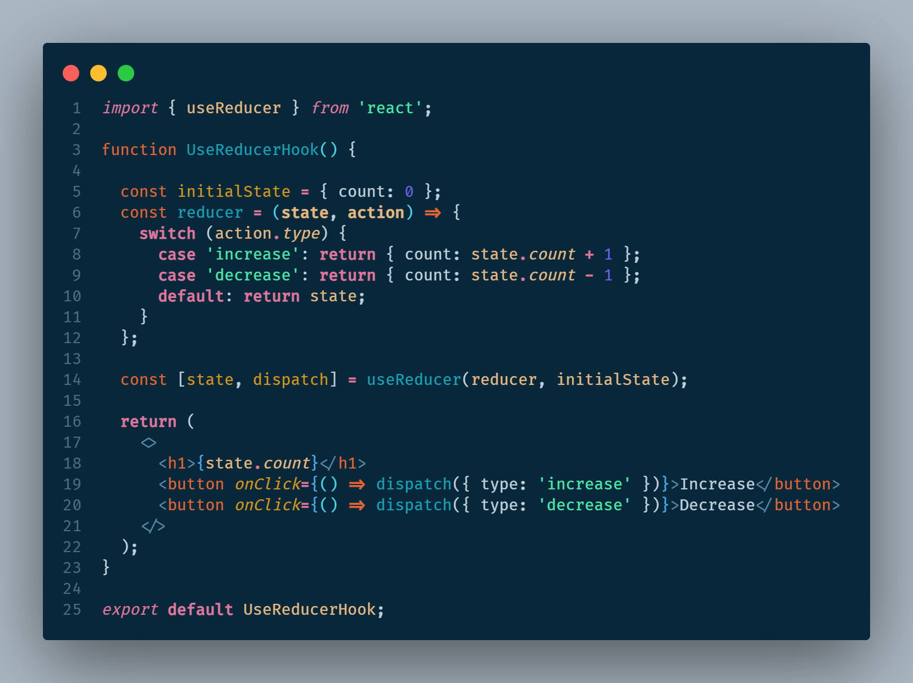
